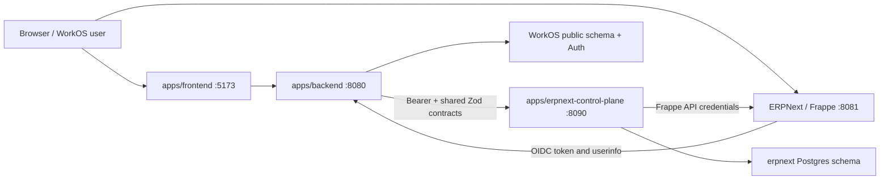

# ERPNext control-plane architecture

Status: implemented for local development **and deployed to Azure** (2026-07-20).
The cloud deployment is documented in `../runbooks/cloud-deploy.md`; this document
describes the architecture and boundaries, which are unchanged by that deployment.

Last verified: 2026-07-29 (fresh local tenant provisioning, setup verification, SSO, and user reconciliation).

## Purpose

ERPNext is operationally separate from WorkOS without duplicating WorkOS identity or business policy. WorkOS remains the identity provider and browser-facing API. The independently runnable control-plane owns ERPNext operational access and secrets.



## Ownership matrix

| Concern | Owner | Authoritative implementation |
|---|---|---|
| Supabase auth, companies, membership | WorkOS backend | `apps/backend/src` |
| RBAC policy and desired Frappe roles | WorkOS backend | `apps/backend/src/lib/erpnextRoleMapping.ts`, `apps/backend/src/lib/erpnextOutbox.ts` |
| OIDC provider and client secret | WorkOS backend | `apps/backend/src/routes/oidc.ts` |
| Browser ERP APIs and status URL | WorkOS backend | `apps/backend/src/domains/workos-erp/` |
| WorkOS projections and Copilot | WorkOS backend | `apps/backend/src/domains/workos-erp/` |
| Durable WorkOS-to-ERP commands | WorkOS backend | `apps/backend/src/lib/erpnextOutbox.ts` |
| Tenant provisioning and status | Control-plane | `apps/erpnext-control-plane/src/provisionWorker.ts`, `src/tenantStore.ts` |
| Frappe credentials and HTTP access | Control-plane | `apps/erpnext-control-plane/src/crypto.ts`, `src/frappe/client.ts` |
| Branding, SSO key, Frappe users | Control-plane | `apps/erpnext-control-plane/src/frappe/client.ts` |
| Cross-app runtime payloads | Shared contracts | `packages/erpnext-contracts/src/index.ts` |

The only shared ERP package is `@cybranex/erpnext-contracts`, because both applications consume it. A Frappe client and WorkOS projection package remain private to their single consumers.

## Control and data flow

### Provisioning

1. Company creation in `apps/backend/src/routes/companies.ts` enqueues three coalesced commands: `provision_tenant`, `configure_sso`, and `reconcile_users`.
2. The WorkOS outbox worker claims only rows matching `ERPNEXT_TARGET_ENV`.
3. The control-plane persists a provision job and tenant state before returning `202`.
4. Its worker records the active stage and heartbeat, creates or reuses the Frappe site under a per-site container lock, verifies installed apps, generates Administrator API keys, **completes and verifies ERPNext's setup wizard**, applies branding, encrypts credentials, and marks the tenant ready.
5. SSO and user commands may initially retry with `tenant_not_ready`; they converge after the tenant reaches `ready`.

On a provisioning failure, the worker stores a bounded, redacted diagnostic in both
`erpnext.provision_jobs.last_error` and `erpnext.tenants.last_error`. Local Docker
failures identify the lifecycle stage, command class, exit status, signal, and safe
stderr; generated credentials and configured secret values are never persisted.

The safe tenant-status response exposes `provisioningStage` only while a provision job is
active. The Settings page polls its authenticated backend status endpoint every five seconds
while the tenant is provisioning; it never receives credentials or raw diagnostics.

Both local provisioning and the checked-in remote-shim source use a per-site container lock,
an inner `timeout`, an installed-app verification, and only then generate credentials. The
remote mirror must still be deployed to the Azure VM separately; changing this repository does
not alter a running remote shim.

Sites are created with **both** `erpnext` and `crm` (Frappe CRM) installed, in
that order — `crm` declares no `required_apps`, so ordering is not enforced for
us, and the CRM Deal → Customer/Quotation hand-off needs `erpnext` present. See
"Frappe apps and the custom image" below.

### Completing ERPNext setup

A site from `bench new-site --install-app erpnext` has no `Company`, chart of accounts or
fiscal year until ERPNext's setup wizard runs, and its `install_fixtures` crashes on a null
country. `completeSetup()` in `src/frappe/client.ts` runs that wizard over REST — both
`initialize_system_settings_and_user` and `setup_complete` are `@frappe.whitelist()`, so no
`bench` access is needed and **local and remote share one implementation**; nothing is
duplicated into the remote shim.

It runs before `applyBranding()` (the wizard rewrites workspaces and Website Settings) and
before `status='ready'`, followed by a persisted `System Settings.setup_complete` and Company
postcondition check. A 2xx setup response alone is not enough because Frappe can return success
while another setup request owns its lock. Thus `ready` implies the tenant is genuinely usable — which is
what `resolveErpNextCreds()` and the V4 ERPNext focus workspaces assume.

`initialize_system_settings_and_user` must precede `setup_complete`: once frappe's own stage
is marked complete in `Installed Application`, `process_setup_stages()` calls
`set_missing_values()`, which overwrites `country`/`currency`/`time_zone` in the args from
System Settings. Writing System Settings first is what lets a retry after a partial failure
converge instead of failing identically.

The company's locale facts (`companyName`, `country`, `currency`, fiscal-year dates,
`timezone`) arrive on `ProvisionTenantRequest` and are stored on `erpnext.provision_jobs`
(migration `002`) because the worker claims the job long after the request. The
control-plane does **not** read `public.companies` — the backend resolves them in
`companySetupFacts()` (`apps/backend/src/lib/erpnextOutbox.ts`).

### User and role reconciliation

1. Membership, department, or RBAC mutations enqueue a company-level reconciliation; the business mutation does not depend on ERPNext availability.
2. WorkOS computes the complete desired user/role set from active company membership and grants.
3. The control-plane upserts desired Frappe users and disables users previously managed for that tenant but absent from the new set.
4. A 30-minute WorkOS safety pass re-enqueues SSO and user reconciliation for ready tenants.

### Record reads and projections

WorkOS projection code calls `apps/backend/src/adapters/erpnext.ts`, which uses the internal control-plane client. The control-plane executes Frappe reads as a batch and returns independent results so one failed query does not erase successful sibling results. Business interpretation remains in WorkOS.

### Tenant business writes

Added 2026-07-22. WorkOS may write tenant business data only through purpose-specific,
allowlisted commands — there is no generic doctype writer. Each command names its own
doctypes and fields internally, so a caller can never choose them.

| Endpoint | Applies |
| --- | --- |
| `PUT /internal/v1/tenants/:companyId/lead-sync` | Frappe CRM Facebook lead syncing for a Meta lead form WorkOS created: the `workos_meta_ad_id` custom field, a `Lead Sync Source`, and question-to-CRM-field mappings. |
| `PUT /internal/v1/tenants/:companyId/lead-attribution` | The originating Meta ad id onto already-synced `CRM Lead` rows. |

Both use the `configure_sso` shape: environment guard, `command_receipts` idempotency
short-circuit, apply, receipt. `erpnext.command_receipts.command_kind` is plain text, so
new commands need no migration.

Two Frappe behaviours constrain `lead-sync` and are easy to break by "simplifying":

- `Lead Sync Source.before_insert` calls Graph `/me/accounts`, which a Page-scoped token
  cannot do. The source is inserted with a discovery (user) token and switched to the
  Page-scoped token last. Frappe keeps Password values in `__Auth` (upserted) and stores
  only a `*****` mask on the doc column, so the swap leaves nothing behind.
- That same hook creates the `Facebook Page` and `Facebook Lead Form` rows. WorkOS must not
  write those doctypes itself.

### Browser SSO

1. A signed-in user opens `http://erp-<company-slug>.localhost:8081` and clicks `Login with workos`.
2. Frappe redirects the browser to `http://localhost:5173/oauth/authorize`.
3. `apps/frontend/src/pages/OAuthAuthorizePage.tsx` uses the existing Supabase session to call WorkOS `POST /api/oidc/authorize`.
4. The browser returns the one-time code to the company-specific Frappe callback.
5. Frappe exchanges the code and reads user info through `http://host.docker.internal:8080/api/oidc`.
6. Frappe creates the session for the pre-reconciled email and roles.

The Settings page obtains `deskUrl` from authenticated `GET /api/erpnext/status`; it does not construct a hostname or receive the control-plane URL or credentials.

## Internal API

All `/internal/v1/*` routes require `Authorization: Bearer <shared token>`. `/healthz` is public.

| Method and path | Behavior |
|---|---|
| `POST /internal/v1/tenants/:companyId/provision` | Validate environment/slug/idempotency key, durably enqueue, return `202`. |
| `GET /internal/v1/tenants/:companyId/status` | Return safe status, site name, Desk URL, and normalized error. |
| `GET /internal/v1/tenants` | List safe tenant statuses for one environment. |
| `POST /internal/v1/tenants/:companyId/records/query-batch` | Execute bounded Frappe reads with per-query results. |
| `PUT /internal/v1/tenants/:companyId/users` | Apply the complete desired managed-user set and disable omissions. |
| `PUT /internal/v1/tenants/:companyId/sso` | Idempotently apply the WorkOS Social Login Key to a ready site. |

Normalized service errors use `{ code, message, retryable }`. Runtime schemas are in `packages/erpnext-contracts/src/index.ts`.

## Persistence and secret boundaries

| Store | Owned data |
|---|---|
| `public.oidc_clients` | WorkOS OIDC client per `(company_id, environment, provider_name)`; secret encrypted with WorkOS `ENCRYPTION_KEY`. |
| `public.erpnext_command_outbox` | Environment-scoped command references, retry state, generation, and locks; no plaintext client secret. |
| `erpnext.tenants` | Tenant status, safe URLs, and Frappe API credentials encrypted with control-plane `ERPNEXT_CREDENTIALS_KEY`. |
| `erpnext.provision_jobs` | Durable provisioning jobs, idempotency, attempts, locks, current stage, stage start, and heartbeat. |
| `erpnext.managed_users` | Last applied managed-user state used to disable removals. |
| `erpnext.command_receipts` | Mutating-command idempotency receipts. |

WorkOS migration: `apps/backend/db/migrations/035_erpnext_control_plane_outbox.sql`.

Control-plane migrations: `apps/erpnext-control-plane/db/migrations/001_control_plane.sql`
through `003_provision_lifecycle.sql`; apply them with `pnpm --filter erpnext-control-plane db:migrate`.

## Frappe apps and the custom image

Tenant sites run two Frappe apps: `erpnext` (the ERP ledger) and `crm`
(Frappe CRM, the pre-sale pipeline UI). They are **parallel** apps, not layered:
Frappe CRM's `CRM Lead`/`CRM Deal` are distinct doctypes from ERPNext's native
`Lead`/`Opportunity`, with their own permission model
(`crm.permissions.org_hierarchy`, not the Role Permission Manager).

WorkOS's Sales projection reads `CRM Lead`/`CRM Deal` for pipeline and
lead/deal performance nodes, `CRM Organization` for the firmographic/ICP view,
and continues to read native `Customer`, `Contact`, `Territory`, `Quotation`,
`Sales Order`, and `Sales Invoice` for accounts and revenue
(`apps/backend/src/domains/workos-erp/erpnextSales.ts`).

Segmentation spans both models. `industry` and `territory` share a fieldname on
each side; `no_of_employees` and `annual_revenue` are CRM-only; `market_segment`
and `customer_group` are ERPNext-only. The ICP node reads `CRM Organization`
(prospect pool) and `Customer` (won accounts) together so the two can be
compared — it derives ICP fit from firmographics rather than reading a stored
tier, which is why it is marked `partial` rather than fully supported.

Frappe apps live in the **image layer**, not in the `sites`/`logs` volumes, so
`crm` cannot be added at runtime — a `bench get-app` inside a running container
is lost on the next `docker compose up`. Both stacks therefore run a custom
image built from `infra/erpnext-image/` (`apps.json` + `Containerfile`) and
published to ACR as `startupdigitaltwin123.azurecr.io/erpnext-crm`:

- local: `../infra/erpnext/pwd.yml` (a `frappe_docker` clone, sibling of this repo);
- remote: `/home/erpadmin/frappe_docker/pwd.yml` on the `erpnext-vm` Azure VM.

Both stacks pin the same tag. Build and rollout commands are in
`../runbooks/cloud-deploy.md`.

Two consequences of apps living in the image layer:

- **`sites/apps.txt` is state, not derived.** It lives in the shared `sites` volume and
  records which apps the bench believes exist. After an image swap it still lists the old
  set, and `bench install-app <new>` fails with `App <new> not in apps.txt`. Locally the
  `configurator` service rewrites it on every `up`; the production VM's
  `frappe-compose.service` excludes `configurator`, so there it must be regenerated by hand.
- **Sites created before an image change keep their old app set.** Only newly provisioned
  sites get new apps automatically; existing ones need a one-time `install-app`, and — if
  the image also bumped the framework version — a `bench migrate`.

The CRM-to-ledger hand-off is Frappe CRM's own first-party integration ("ERPNext CRM
Settings", enabled per site in Desk), which creates a native `Customer`/`Quotation` from a
won `CRM Deal`. It is not custom code in this repository. Note the resulting name
collision: ERPNext's native `CRM Settings` singleton is a **different** doctype from
Frappe CRM's `ERPNext CRM Settings` singleton.

## Local and remote isolation

- A control-plane process serves exactly one `ERPNEXT_ENV` and rejects mismatched requests.
- The WorkOS dispatcher claims only its configured `ERPNEXT_TARGET_ENV`.
- Local provisioning uses Docker and sites named `erp-<slug>.localhost`.
- Remote provisioning uses the configured remote provisioning shim — a small Node/Express
  service on the VM that runs `bench` on the control-plane's behalf (the control-plane
  cannot reach the VM's Docker socket). The version-controlled source at
  `infra/erpnext-remote-shim/` mirrors local site creation and must be deployed manually to
  affect the VM. The VM's currently deployed behavior must be verified separately.
- **Deployed (2026-07-20):** a `remote` control-plane runs as the Azure Container App
  `erpnext-control-plane` (env `startup-twin-env`, RG `startup-digital-twin-rg`,
  **internal ingress**, port 8090). It calls the existing ERPNext VM shim/Frappe — the
  VM stack was not replaced. The backend reaches it over the environment-internal FQDN
  with `ERPNEXT_TARGET_ENV=remote`. See `../runbooks/cloud-deploy.md`.
- The control-plane's `erpnext` schema currently lives in the **same** Supabase Postgres
  as the WorkOS `public` schema. Isolation is by schema and by the code-level boundary
  (enforced by `apps/backend/test/erpnextArchitecture.test.ts`), not by a separate database.

## Verification

```bash
pnpm --filter @cybranex/erpnext-contracts test
pnpm --filter erpnext-control-plane test
pnpm --filter backend test:erpnext-architecture
pnpm --filter backend test:sales-stories
pnpm typecheck:backend
pnpm typecheck:erpnext-control-plane
```

For end-to-end verification, follow `../runbooks/local-erpnext-sso.md`.

## Known gaps

### ~~Tenants are provisioned unconfigured~~ (fixed 2026-07-22)

Provisioning used to stop after `bench new-site` + `generate_keys`, leaving every tenant
marked `ready` with no `Company`, chart of accounts, fiscal year, or default currency, and
dumping the first user onto `/desk/setup-wizard/0`. See "Completing ERPNext setup" above
for the current behaviour and `../runbooks/cloud-deploy.md` for the history.

### Provisioning lifecycle and worker shutdown

The control-plane persists each job's current stage, heartbeat, and stage start time. Site
creation is serialized inside the Frappe backend container and bounded there, so cancelling the
host-side Docker client cannot leave an unbounded `bench new-site` process. The control-plane
owns process shutdown centrally: it stops the worker, closes its HTTP listener, and closes the
database pool. A watched process therefore cannot continue serving `/healthz` with a dead worker
loop. The checked-in remote shim follows the same protocol, but needs a manual VM deployment
before it can protect remote tenants. Setup completion deliberately remains in the control-plane
and covers both local and remote paths.

For local development, run exactly one frontend, backend, and control-plane process. Starting a
second watcher can leave an old process holding port `8090`; `/healthz` may then describe the
wrong process rather than the intended worker. The local runbook includes a scoped clean-restart
procedure and requires inspection of the outbox/job rows when provisioning does not advance.

### Dropped Postgres connection kills both workers (2026-07-21, unfixed)

Both the backend and the control-plane can be killed by a dropped Postgres connection.
Each has a `pool.on('error', ...)` handler, but that covers only **idle** pooled clients;
a client checked out via `pool.connect()` for a transaction is not covered, and
`Connection terminated unexpectedly` then surfaces as an unhandled `error` event that
exits the process. Both outbox workers claim rows inside exactly such a transaction
(`FOR UPDATE SKIP LOCKED`), so this reliably takes down provisioning. Observed on both
services on 2026-07-21; provisioning silently stalled for hours. Not yet fixed.

## Update this document when

- component ownership, ports, internal endpoints, contracts, migrations, command kinds, environment behavior, SSO URLs, site naming, or secret storage changes;
- the set of installed Frappe apps, the custom image tag, or which doctypes the WorkOS Sales projection reads changes;
- the cloud deployment topology, ingress mode, or hosting environment changes (see `../runbooks/cloud-deploy.md`);
- the control-plane moves to its own database rather than a schema in the shared Postgres;
- a second consumer justifies extracting another shared ERP package.
