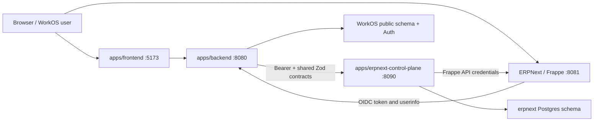

# ERPNext control-plane architecture

Status: implemented for local development **and deployed to Azure** (2026-07-20).
The cloud deployment is documented in `../runbooks/cloud-deploy.md`; this document
describes the architecture and boundaries, which are unchanged by that deployment.

Last verified: 2026-07-13.

## Purpose

ERPNext is operationally separate from WorkOS without duplicating WorkOS identity or business policy. WorkOS remains the identity provider and browser-facing API. The independently runnable control-plane owns ERPNext operational access and secrets.



## Ownership matrix

| Concern | Owner | Authoritative implementation |
|---|---|---|
| Supabase auth, companies, membership | WorkOS backend | `apps/backend/src` |
| RBAC policy and desired Frappe roles | WorkOS backend | `apps/backend/src/lib/erpnextRoleMapping.ts`, `apps/backend/src/lib/erpnextOutbox.ts` |
| OIDC provider and client secret | WorkOS backend | `apps/backend/src/routes/oidc.ts` |
| Browser ERP APIs and status URL | WorkOS backend | `apps/backend/src/domains/workos-erp/` |
| WorkOS projections and Copilot | WorkOS backend | `apps/backend/src/domains/workos-erp/` |
| Durable WorkOS-to-ERP commands | WorkOS backend | `apps/backend/src/lib/erpnextOutbox.ts` |
| Tenant provisioning and status | Control-plane | `apps/erpnext-control-plane/src/provisionWorker.ts`, `src/tenantStore.ts` |
| Frappe credentials and HTTP access | Control-plane | `apps/erpnext-control-plane/src/crypto.ts`, `src/frappe/client.ts` |
| Branding, SSO key, Frappe users | Control-plane | `apps/erpnext-control-plane/src/frappe/client.ts` |
| Cross-app runtime payloads | Shared contracts | `packages/erpnext-contracts/src/index.ts` |

The only shared ERP package is `@cybranex/erpnext-contracts`, because both applications consume it. A Frappe client and WorkOS projection package remain private to their single consumers.

## Control and data flow

### Provisioning

1. Company creation in `apps/backend/src/routes/companies.ts` enqueues three coalesced commands: `provision_tenant`, `configure_sso`, and `reconcile_users`.
2. The WorkOS outbox worker claims only rows matching `ERPNEXT_TARGET_ENV`.
3. The control-plane persists a provision job and tenant state before returning `202`.
4. Its worker creates or reuses the Frappe site, generates Administrator API keys, applies branding, encrypts credentials, and marks the tenant ready.
5. SSO and user commands retry until status is `ready`.

### User and role reconciliation

1. Membership, department, or RBAC mutations enqueue a company-level reconciliation; the business mutation does not depend on ERPNext availability.
2. WorkOS computes the complete desired user/role set from active company membership and grants.
3. The control-plane upserts desired Frappe users and disables users previously managed for that tenant but absent from the new set.
4. A 30-minute WorkOS safety pass re-enqueues SSO and user reconciliation for ready tenants.

### Record reads and projections

WorkOS projection code calls `apps/backend/src/adapters/erpnext.ts`, which uses the internal control-plane client. The control-plane executes Frappe reads as a batch and returns independent results so one failed query does not erase successful sibling results. Business interpretation remains in WorkOS.

### Browser SSO

1. A signed-in user opens `http://erp-<company-slug>.localhost:8081` and clicks `Login with workos`.
2. Frappe redirects the browser to `http://localhost:5173/oauth/authorize`.
3. `apps/frontend/src/pages/OAuthAuthorizePage.tsx` uses the existing Supabase session to call WorkOS `POST /api/oidc/authorize`.
4. The browser returns the one-time code to the company-specific Frappe callback.
5. Frappe exchanges the code and reads user info through `http://host.docker.internal:8080/api/oidc`.
6. Frappe creates the session for the pre-reconciled email and roles.

The Settings page obtains `deskUrl` from authenticated `GET /api/erpnext/status`; it does not construct a hostname or receive the control-plane URL or credentials.

## Internal API

All `/internal/v1/*` routes require `Authorization: Bearer <shared token>`. `/healthz` is public.

| Method and path | Behavior |
|---|---|
| `POST /internal/v1/tenants/:companyId/provision` | Validate environment/slug/idempotency key, durably enqueue, return `202`. |
| `GET /internal/v1/tenants/:companyId/status` | Return safe status, site name, Desk URL, and normalized error. |
| `GET /internal/v1/tenants` | List safe tenant statuses for one environment. |
| `POST /internal/v1/tenants/:companyId/records/query-batch` | Execute bounded Frappe reads with per-query results. |
| `PUT /internal/v1/tenants/:companyId/users` | Apply the complete desired managed-user set and disable omissions. |
| `PUT /internal/v1/tenants/:companyId/sso` | Idempotently apply the WorkOS Social Login Key to a ready site. |

Normalized service errors use `{ code, message, retryable }`. Runtime schemas are in `packages/erpnext-contracts/src/index.ts`.

## Persistence and secret boundaries

| Store | Owned data |
|---|---|
| `public.oidc_clients` | WorkOS OIDC client per `(company_id, environment, provider_name)`; secret encrypted with WorkOS `ENCRYPTION_KEY`. |
| `public.erpnext_command_outbox` | Environment-scoped command references, retry state, generation, and locks; no plaintext client secret. |
| `erpnext.tenants` | Tenant status, safe URLs, and Frappe API credentials encrypted with control-plane `ERPNEXT_CREDENTIALS_KEY`. |
| `erpnext.provision_jobs` | Durable provisioning jobs, idempotency, attempts, and locks. |
| `erpnext.managed_users` | Last applied managed-user state used to disable removals. |
| `erpnext.command_receipts` | Mutating-command idempotency receipts. |

WorkOS migration: `apps/backend/db/migrations/035_erpnext_control_plane_outbox.sql`.

Control-plane migration: `apps/erpnext-control-plane/db/migrations/001_control_plane.sql`.

## Local and remote isolation

- A control-plane process serves exactly one `ERPNEXT_ENV` and rejects mismatched requests.
- The WorkOS dispatcher claims only its configured `ERPNEXT_TARGET_ENV`.
- Local provisioning uses Docker and sites named `erp-<slug>.localhost`.
- Remote provisioning uses the configured remote provisioning shim.
- **Deployed (2026-07-20):** a `remote` control-plane runs as the Azure Container App
  `erpnext-control-plane` (env `startup-twin-env`, RG `startup-digital-twin-rg`,
  **internal ingress**, port 8090). It calls the existing ERPNext VM shim/Frappe — the
  VM stack was not replaced. The backend reaches it over the environment-internal FQDN
  with `ERPNEXT_TARGET_ENV=remote`. See `../runbooks/cloud-deploy.md`.
- The control-plane's `erpnext` schema currently lives in the **same** Supabase Postgres
  as the WorkOS `public` schema. Isolation is by schema and by the code-level boundary
  (enforced by `apps/backend/test/erpnextArchitecture.test.ts`), not by a separate database.

## Verification

```bash
pnpm --filter @cybranex/erpnext-contracts test
pnpm --filter erpnext-control-plane test
pnpm --filter backend test:erpnext-architecture
pnpm typecheck:backend
pnpm typecheck:erpnext-control-plane
```

For end-to-end verification, follow `../runbooks/local-erpnext-sso.md`.

## Update this document when

- component ownership, ports, internal endpoints, contracts, migrations, command kinds, environment behavior, SSO URLs, site naming, or secret storage changes;
- the cloud deployment topology, ingress mode, or hosting environment changes (see `../runbooks/cloud-deploy.md`);
- the control-plane moves to its own database rather than a schema in the shared Postgres;
- a second consumer justifies extracting another shared ERP package.
