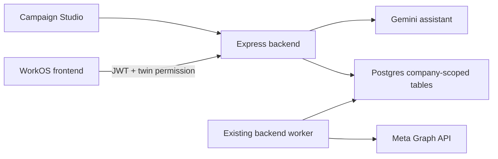

# Native CRM and catalogue architecture

Last verified: 2026-08-10.

## Purpose

WorkOS directly owns the small set of business features currently used by the product. The existing Express backend, Postgres database, Supabase identity, frontend, Gemini integration, and background worker are the complete platform. There is no provisioning service or external business-system runtime.

## Native domains

- CRM: accounts, contacts, leads, deals, lead conversion, deal-stage invariants, and Sales summaries.
- Catalogue: hierarchical groups, products with one current price/currency, and current warehouse balances.
- Meta ingestion: one binding per company/form, hourly polling, authored field mapping, idempotent lead upsert, and cursor advancement only after a fetched page commits.
- Assistant: bounded Gemini tool calls against company-scoped native repositories.
- BDT: native Product and Sales focus workspaces; Operations remains a dependency-free placeholder. Phase 2 commercial records are described in `native-sales-documents.md`.

The schema is introduced by `apps/backend/db/migrations/042_native_crm_catalog.sql`. `043_native_business_security.sql` revokes direct `anon` and `authenticated` table access because this domain is available only through the Express API. Timestamped mirrors under `apps/frontend/supabase/migrations/` build the local Supabase database. Company-safe composite foreign keys prevent cross-tenant relationships at the database boundary. API handlers additionally derive the tenant from `req.auth.companyId` and include it in every query.

## Deliberate limits

Phase 1's CRM/catalogue limits remain unchanged. Phase 2 adds operational quotes, orders, invoices, and manual payments, but still has no accounting, procurement, fulfilment, manufacturing, service/quality records, operations execution model, pricing history, multiple price lists, stock ledger, configurable workflow, webhook receiver, migration importer, or legacy compatibility path.

## Failure behavior

- One Meta binding failure records a bounded error and does not stop other bindings.
- Duplicate Meta deliveries are successful no-ops.
- Lead conversion and deal terminal-stage transitions are transactional.
- Group deletion relies on foreign-key protection while children/products exist.
- Company creation performs no external call and creates no provisioning state.

## Verification

Run `pnpm --filter backend test:native-architecture` for static removal/schema guards and `pnpm test:local:native` for the disposable local-database contract suite. The latter refuses remote database hosts and covers tenant isolation, CRM transitions, catalogue constraints/readiness, assistant tool scoping, Meta mapping/idempotency, and browser-role grants. Also run backend/frontend typechecks, BDT tests, Meta tests, and the relevant workspace journey. Update this document when tables, endpoint ownership, worker scheduling, or Phase 1 scope changes.
